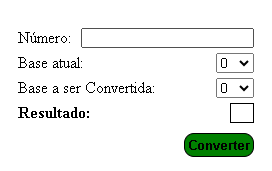

# ConversorDeBasesNuméricas

*Este é um projeto proposto na disciplina Arquitetura de Computadores 1. 
*O projeto consiste na criação de algum sistema que converta um número de uma base para o mesmo número em outra base.
*A equipe optou por desenvolver um sistema WEB que permite a conversão de até 36 bases númericas.

## Alunos integrantes da equipe

* Pedro Rodrigues Alves
* Gabriel Felipe Quaresma de Oliveira
* Luca Lourenço Gonzaga

## Professores responsáveis

* Cláudio Dias Campos

## Instruções de utilização

Para acessar o nosso sistema, existe duas opções. A primeira forma é entrando no link a seguir https://conversorbit.cs50brasil.repl.co/ . A segunda forma é baixar o nosso repositorio na sua maquina, ir em codigo > index.html.

Para utilizar nosso sistema basta inserir o número no campo chamado "Número", selecionar a base atual no campo chamado "Base atual", selecionar a base para a qual o número será convertido no campo chamado "Base a ser Convertida" e depois clickar no botão verde chamado "Converter". Após a realização dessas instruções o resultado irá aparecer no campo chamado "Resultado".

